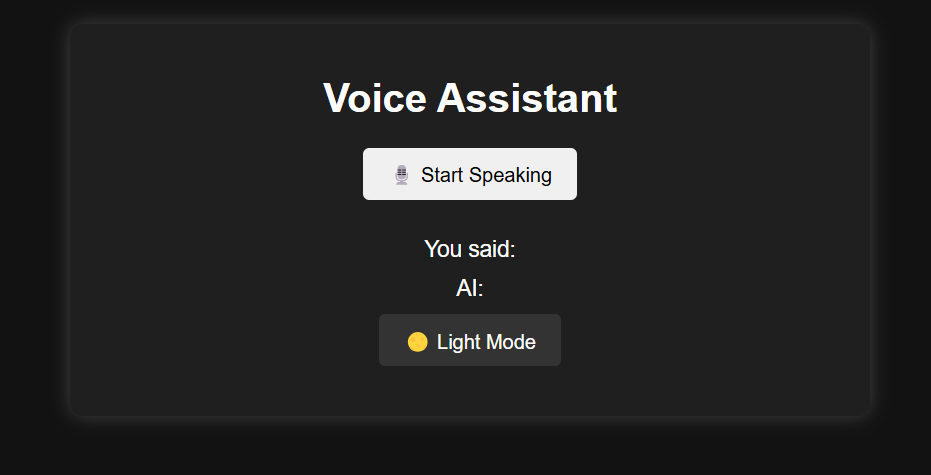

# Voice Assistant with AI and Text-to-Speech

This project is a **Voice Assistant** web application that integrates **OpenAI's GPT-3.5-turbo** for generating AI-based responses and uses **Google Text-to-Speech (TTS)** for audio playback of the responses. It allows users to give voice commands and receive AI responses in both text and audio formats. The application also includes a dark/light mode toggle for better user experience.

---

## Features

- **Voice Input**: Record and send voice commands using the browser's SpeechRecognition API.
- **AI Integration**: Processes user input with OpenAI's GPT-3.5-turbo to generate intelligent responses.
- **Text-to-Speech**: Converts AI-generated responses into audio using Google TTS.
- **Real-Time Interaction**: Communication is handled in real-time using Socket.io.
- **Dark/Light Mode**: Toggle between dark and light themes.
- **Responsive Interface**: Clean and simple UI built with HTML, CSS, and JavaScript.

---

## Demo



---

## Prerequisites

Before running this project, ensure you have the following installed on your system:

1. **Node.js**: [Download and install Node.js](https://nodejs.org/)
2. **npm** (comes with Node.js)
3. An **OpenAI API key**: Sign up at [OpenAI](https://openai.com/) to get your API key.

---

## Installation and Setup

Follow these steps to run the project locally:

1. **Clone the Repository**  
   ```bash
   git clone https://github.com/kalyanAVT/AI-Voice-Assistant.git
   cd AI_Voice_Assistant

## Install Dependencies
Run the following command in the project directory to install the required dependencies
   ```bash
npm install
   ```
## Set Up Environment Variables
Create a .env file in the root of the project directory and add your OpenAI API key:
   ```bash
OPENAI_API_KEY=your_openai_api_key
   ```
## Start the Server
Start the application server with the following command: 
   ```bash
node server.js
   ```
## Access the Application
Open your browser and navigate to:
   ```bash
http://localhost:3000
   ```

## Usage Instructions
- Click the "🎙️ Start Speaking" button to record your voice command.
- The application will process your input and send it to OpenAI's GPT-3.5 for response generation.
- The AI response will be displayed on the interface and played back using audio.
- Use the Dark/Light Mode Toggle to switch themes.

## Technologies Used
### Frontend:
HTML, CSS, JavaScript, SpeechRecognition API, SpeechSynthesis API
### Backend:
Node.js, Express.js, Socket.io
### Third-Party Services:
OpenAI API, Google Text-to-Speech (TTS) API

## Known Issues
The application might not work on older browsers that do not support SpeechRecognition or SpeechSynthesis APIs.
Google TTS has a 200-character limit for each request, so long responses are split into chunks.

## Contribution

Feel free to fork this repository and submit pull requests. Contributions are always welcome!

## License

This project is licensed under the MIT License.
